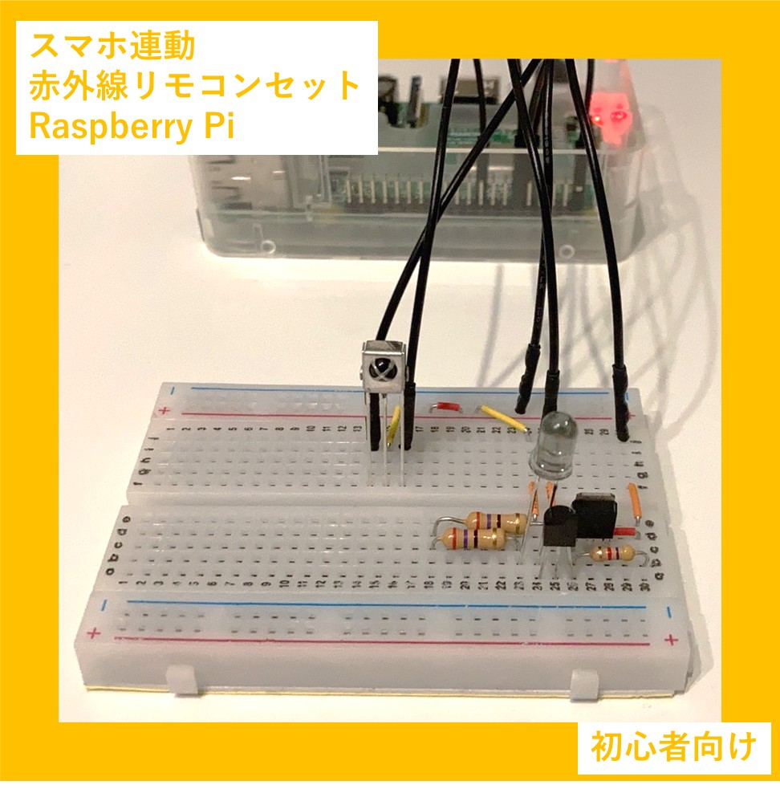
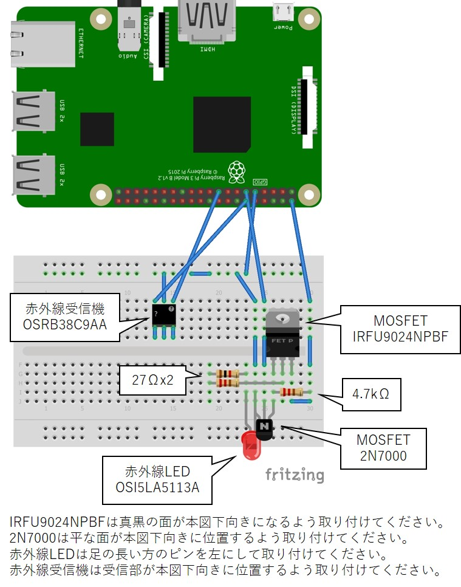

# IR-WebRimocon_v1

## 概要
Raspberry Piを赤外線リモコンとして扱う為のプロジェクトです。
赤外線受信機を使って家庭用リモコンの赤外線コードを記憶し、赤外線LEDで記憶した赤外線コードを発信することができます。
Raspberry PiをWebサーバーにして、同じWiFiネットワークに接続したスマホやノートパソコンから一連の赤外線操作を指示することが出来ます。
赤外線信号は環境によりますが凡そ3m先まで届きます。

## 始め方
docsフォルダ内の「使い方_v1.0」を参照ください。
配線は下図の通りです。

## 特徴
Flaskを用いてRaspberry PiをWebサーバにし、同一WiFiネットワークに接続した別機器から赤外線モジュールを操作できます。
ソースコードのには丁寧にコメントを記載したので、Raspberry PiをWebサーバとして使いたい方の参考になると思います。

## 参考

