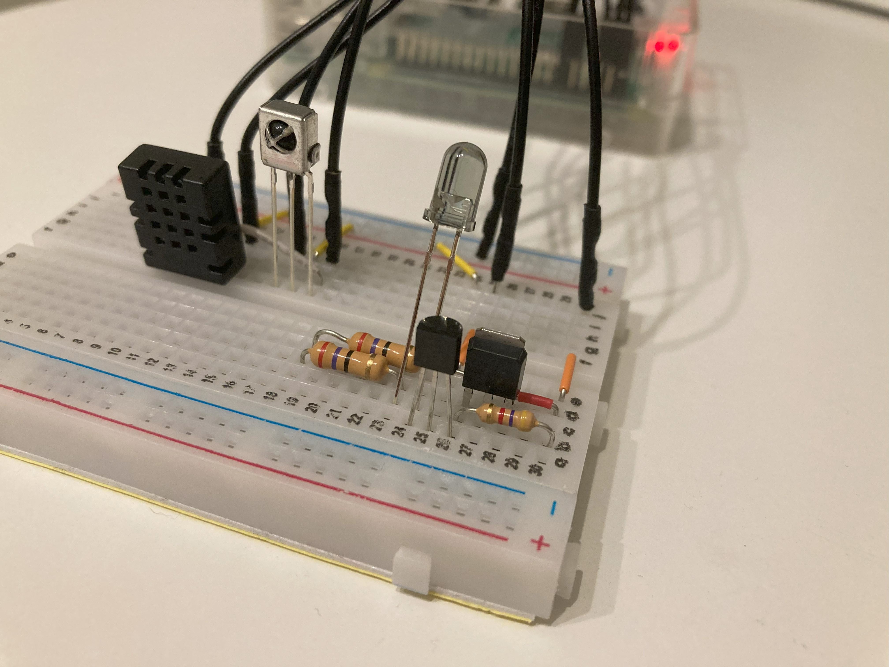
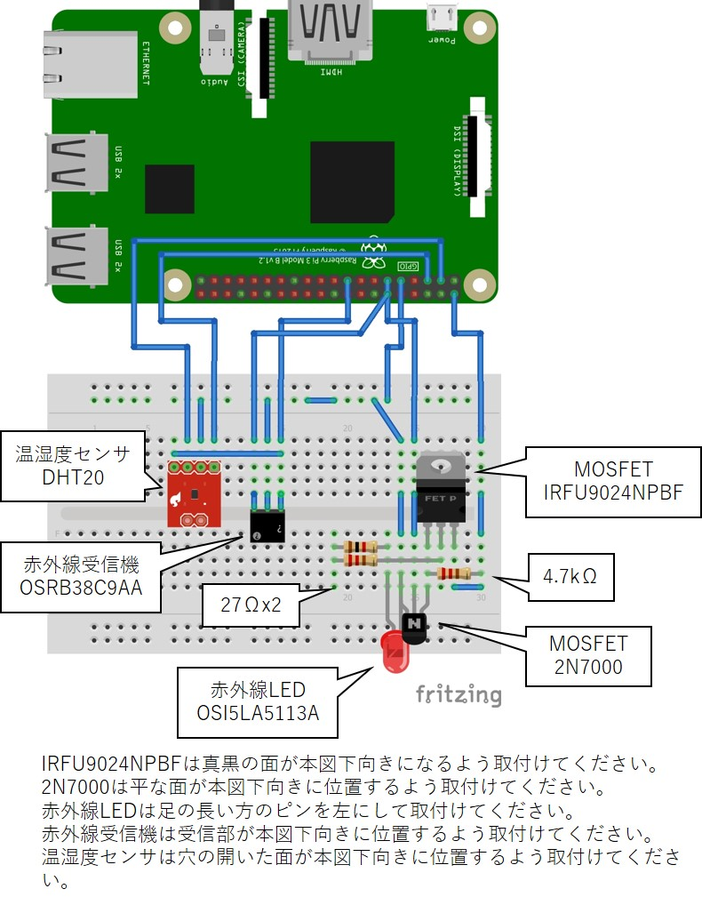

# IR-WebRimocon_v2

## 概要
Raspberry Piを赤外線リモコンとして扱う為のプロジェクトです。
赤外線受信機を使って家庭用リモコンの赤外線コードを記憶し、赤外線LEDで記憶した赤外線コードを発信することができます。
Raspberry PiをWebサーバーにして、同じWiFiネットワークに接続したスマホやノートパソコンから一連の赤外線操作を指示することが出来ます。
また、温湿度センサを備えており、スマホやノートパソコンからセンサで測定した値をリアルタイムに確認することができます。
赤外線モジュールと温湿度センサを組み合わせることで「所定の温度で特定の機器を自動でON/OFFする」といった制御を実現できます。

## 始め方
docsフォルダ内の「使い方_v2.0」を参照ください。
配線は下図の通りです。

## 特徴
Flaskを用いてRaspberry PiをWebサーバにし、同一WiFiネットワークに接続した別機器から赤外線モジュールを操作できます。

## 参考

